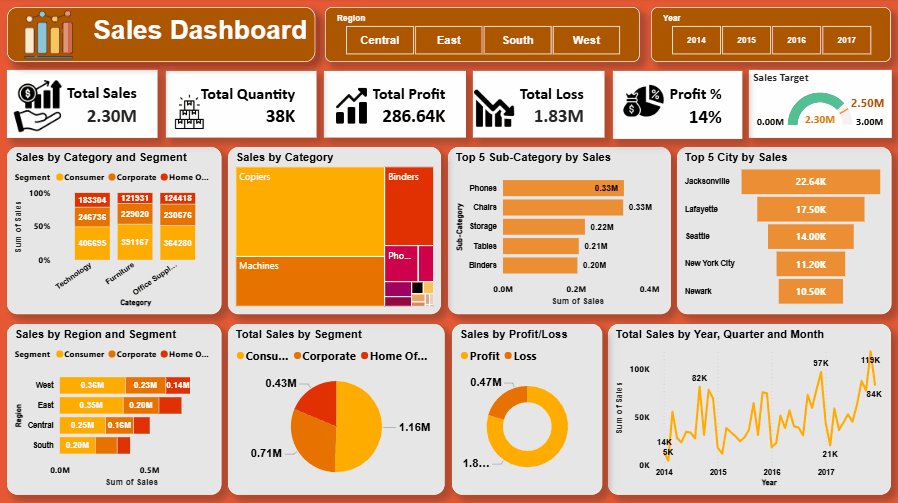

# 📊 Sales Dashboard | Power BI

## 📌 Project Overview

This Power BI Sales Dashboard provides a comprehensive analysis of sales performance across different regions, categories, segments, cities, and time periods. The dashboard helps stakeholders monitor key business metrics, identify profitable areas, and track sales trends for data-driven decision-making.

## 🎯 Key Features

- Total Sales, Profit, Quantity, and Loss Overview
- Regional Sales Performance Analysis
- Category & Sub-Category Sales Breakdown
- Customer Segment Analysis
- Top Performing Cities
- Profit vs Loss Comparison
- Yearly, Quarterly, and Monthly Sales Trends
- Interactive Filters for Region and Year Selection
- Sales Target Achievement Tracking

## 📈 Dashboard Preview

<p align="center">
  
</p>

## 🔑 KPIs Included

| KPI | Value |
|------|------|
| Total Sales | 2.30M |
| Total Quantity | 38K |
| Total Profit | 286.64K |
| Total Loss | 1.83M |
| Profit % | 14% |

## 📊 Visualizations Used

- KPI Cards
- Treemap
- Stacked Bar Charts
- Funnel Chart
- Donut Chart
- Gauge Chart
- Line Chart
- Slicers

## 🛠 Tools & Technologies

- Power BI Desktop
- Microsoft Excel
- Data Modeling
- DAX Measures
- Data Visualization

## 📂 Project Structure

```
Sales-Dashboard/
│
├── Dashboard/
│   └── Sales Dashboard.pbix
│
├── Data/
│   └── Sales_Data.xlsx
│
├── Images/
│   └── dashboard.gif
│
└── README.md
```

## 📌 Insights Generated

- Consumer segment contributes the highest sales.
- Technology category generates strong revenue performance.
- Jacksonville is the top-performing city by sales.
- Sales show an overall upward trend from 2014 to 2017.
- Profitability can be improved by reducing losses in underperforming segments.

## 🚀 How to Use

1. Download the repository.
2. Open `Dashboard/Sales Dashboard.pbix` in Power BI Desktop.
3. Refresh the data source if required.
4. Explore the dashboard using slicers and filters.

## 👨‍💻 Author

**Kailash Kumar**

- Data Analyst
- Power BI | Excel | SQL | Tableau

### ⭐ If you found this project useful, please give it a star.
